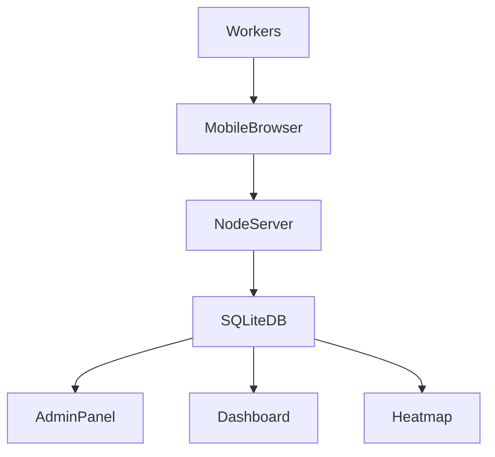

# Trash Heatmap

Trash Heatmap is a lightweight event management system for tracking when trash bins are emptied during large indoor events.

Workers scan a QR code attached to each trash bin and log when the bin has been emptied. The system collects this data and generates insights such as:

- Heatmaps of bin usage
- Worker activity tracking
- Most frequently emptied bins
- Recommendations for optimal bin placement next year

The system is designed to run on a **local Ubuntu laptop server** inside the event network.

---

# Features

### QR Code Bin Logging
Each trash bin has a QR code.

When scanned, the worker is taken to a logging page where they confirm:

- bin number
- their username

The system logs:

- worker name
- bin ID
- timestamp

---

### Smart Duplicate Protection

To prevent accidental double logging:

- Same worker cannot log the same bin within **2 minutes**

---

### Admin Panel

Admin can:

- Add workers
- Delete workers
- View registered users

Protected login required.

Default admin login:
username: Buildcat
password: buildcat

---

### Drag & Drop Bin Placement

Bins can be positioned on the event map using **drag & drop coordinates** instead of GPS.

This allows accurate indoor positioning.

---

### Heatmap Generation

The server can generate heatmaps showing:

- which bins are emptied most frequently
- which areas produce the most trash

This helps plan **better bin placement for future events**.

---

### Real-time Dashboard

Admin dashboard can display:

- most active bins
- most active workers
- live emptying logs

Useful during the event.

---

## System Architecture

```text
Workers
│
│ scan QR
▼
Mobile Browser
│
│ POST log
▼
Node.js Server
│
│ store data
▼
SQLite Database
│
├─ Admin panel
├─ Dashboard
└─ Heatmap generator
```

---

# Technology Stack

Backend

- Node.js
- Express
- SQLite

Frontend

- HTML
- CSS
- JavaScript

QR Code

- QRCode.js

---

# Installation

Clone repository
```bash
git clone https://github.com/kelemi90/trash_heatmap.git
cd trash_heatmap
```
Install dependencies
```npm install```

Start Server
```node server/server.js```

Server will start on:
```http://localhost:3001```

and also show the **local network IP address**.
Workers should use the **network address**.
Example:
```http://192.168.1.20:3001```


---

## Project Structure
```text
trash_heatmap
│
├─ server
│ ├─ routes
│ │ ├─ auth.js
│ │ ├─ bins.js
│ │ ├─ logs.js
│ │ ├─ users.js
│ │ └─ qrLabels.js
│ │
│ ├─ middleware
│ │ └─ adminAuth.js
│ │
│ ├─ db.js
│ └─ server.js
│
├─ public
│ ├─ admin.html
│ ├─ admin_login.html
│ ├─ bin.html
│ ├─ bin_editor.html
│ ├─ scanner.html
│ ├─ qr_labels.html
│ └─ map
│
├─ scripts
│ ├─ createAdmin.js
│ └─ createBins.js
│
├─ database
│ └─ trash.db
│
├─ .gitignore
└─ README.md
```

---

# Event Configuration

Event dates:
Thursday June 4 2026
Friday June 5 2026
Saturday June 6 2026
Sunday June 7 2026

Total bins:
55 trash bins

Workers:
~20 workers


---

# QR Label Generation

QR labels can be generated from:
/qr_labels.html


Features:

- Generate all 55 bin labels
- Print-ready layout
- Automatic server IP detection

---

# Security

- Admin pages protected with session login
- Workers must exist in the database to log bins
- Duplicate logging protection

---

# Future Improvements

Possible upgrades:

- live event dashboard
- automatic heatmap visualization
- worker performance statistics
- bin overflow prediction
- AI recommendations for next year's bin placement

---

# License

MIT License